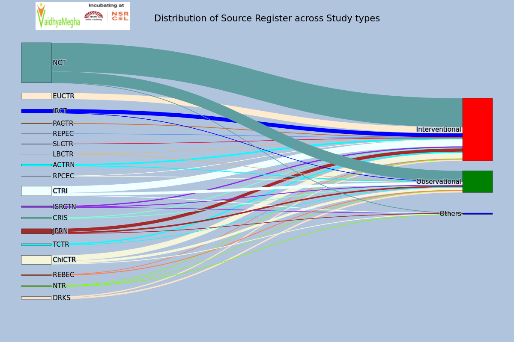
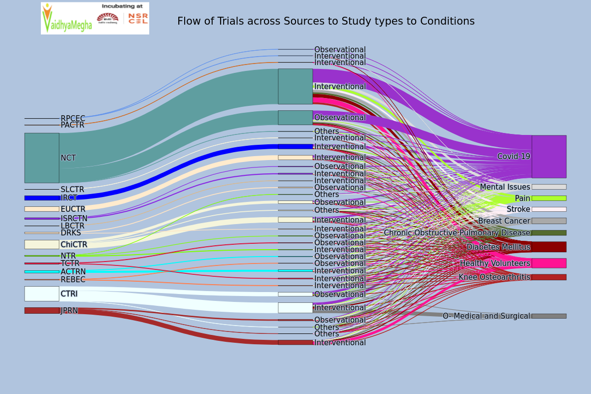
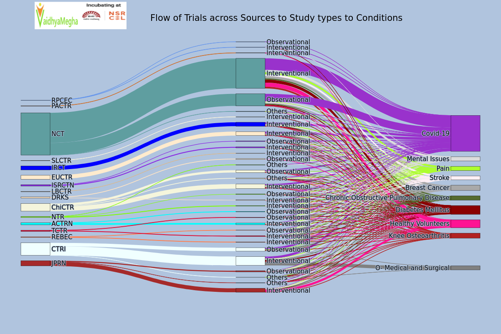

# Recent changes in clinical trials across the globe

# Feb 02nd 2022 Observations

# Table of contents
1. [Introduction](#Introduction)
2. [Top 10 Trial Conditions for 2 years](#Top10TrialConditions)
3. [Distribution of Source Register across Study types for 2 years](#Source_to_Study)
    
4. [Distribution of Source Register across Trial Conditions for 2 years](#Source_to_Conditions)
5. [Flow of Trials across Sources to Study types to Conditions for 2 years](#Source_to_StudyType_to_Conditions)

## Introduction 
With reference to WHO’s ICTRP dataset for the last 2 years and performed 2 times in the time range of two weeks.

## Top 10 Trial Conditions for 2 years 

**Analysis Performed on 1st Feb, 2022**

<!--  -->

**Analysis Performed on 25th Jan, 2022**

<!--  -->

By seeing above two charts of analysis which were performed on 1st Feb 2022 and 25th Jan 2022 , we can observe that the changes of percentages of some trials in two weeks approximately.

| S. No. |             Trial Condition            | % Of first analysis | % Of second analysis |       Remarks      |
|:------:|:--------------------------------------:|:-------------------:|:--------------------:|:------------------:|
| 1      | Covid -19                              | 33.8                | 33.5                 | Increased by 0.3%  |
| 2      | Diabetes Mellitus                      | 8.23                | 8.23                 | No Change |
| 3      | Healthy Volunteers                     | 7.54                | 7.56                 | Increased by 0.02% |
| 4      | Breast Cancer                          | 4.78                | 4.83                 | Decreased by 0.05% |
| 5      | Knee Osteoarthritis                    | 4.64                | 4.64                 | No Change |
| 6      | Mental Issues                          | 4.12                | 4.13                 | Decreased by 0.01% |
| 7      | Chronic Obstructive Pulmonary Diseases | 4.05                | 4.06                 | Decreased by 0.01% |
| 8      | Pain                                   | 3.87                | 3.90                 | Decreased by 0.03% |
| 9      | O- Medical and Surgical                | 3.66                | 3.67                 | Decreased by 0.01% |
| 10     | Stroke                                 | 3.60                | 3.63                 | Decreased by 0.03% |

From the above there is a 0.3% increment in Covid-19 and 0.02% increment in Healthy Volunteers.

## Distribution of Source Register across Study types for 2 years 

**Analysis performed on 1st Feb, 2022**

<!--  -->

**Analysis performed on 25th Jan, 2022**

<!--  -->

 | S.No |Source Register |Interventional |Observational |Others |
 |--- | --- | --- | --- | --- | 
 | 1 | ACTRN | 42 | 13 |  | 
 | 2 | CRIS | -10 | -5 |  | 
 | 3 | CTRI | -91 | -31 | -2 | 
 | 4 | ChiCTR | -61 | -19 | -13 | 
 | 5 | DRKS | -19 | -19 |  | 
 | 6 | EUCTR | -66 |  |  | 
 | 7 | IRCT | -68 | 0 |  | 
 | 8 | ISRCTN | -12 | -4 | 0 | 
 | 9 | JPRN | -39 | -11 | 0 | 
 | 10 | LBCTR | 0 | 0 |  | 
 | 11 | NCT | -467 | -144 | -3 | 
 | 12 | NTR | -8 | -7 | 0 | 
 | 13 | PACTR | -10 |  |  | 
 | 14 | REBEC | -19 | -1 |  | 
 | 15 | REPEC | -1 |  |  | 
 | 16 | RPCEC | 0 | 0 |  | 
 | 17 | SLCTR | -1 |  |  | 
 | 18 | TCTR | -16 | -3 |  | 

The above table represents the changes in clinical trials registrations in two weeks approximately.

# Distribution of Source Register across Trial Conditions for 2 years 

**Analysis performed on 1st Feb, 2022**

<!--  -->

**Analysis performed on 25th Jan, 2022**

<!--  -->

| Source Register |Breast Cancer |Chronic Obstructive Pulmonary Disease |Covid-19 |Diabetes Mellitus |Healthy Volunteers |Knee Osteoarthritis |Mental Issues |O- Medical and Surgical |Pain |Stroke |
 |--- | --- | --- | --- | --- | --- | --- | --- | --- | --- | --- | 
 | ACTRN | -1 | 1 | 3 | 3 |  | 2 | 1 |  | 2| 1 | 
 | CTRI | -1| -2 | 0 | -3 |  | -1 |  | -7 | -1| 0 | 
 | ChiCTR | -2 | 0 | -2 | -1.| 0 | -1 | 0 |  | 0 | -2 | 
 | DRKS | 0 | 0 | 0 | 0 | -1 | 0 | 0 |  | 0 | 0 | 
 | EUCTR | -2 | 1 | 1 | -2 | 0 | 0 |  |  | 0 | 0 | 
 | IRCT | -1 | -1 | 0 | 0 | 0 | -1 | -2 |  | -3 | -1 | 
 | ISRCTN | 0 | -1 | 1 | 0 | 0 | -2 | 0 |  | -1 | 0 | 
 | JPRN | -1 | 0 | 0 | -2 | -6 | 0 | -1 |  | 0 | 0 | 
 | LBCTR | 0 |  | 0 |  |  |  | 0 |  |  |  | 
 | NCT | -11 | -8 | 11 | -8 | -8 | -4 | -6 |  | -12 | -9 | 
 | NTR | -1 | 0 | 0 | 0 | 0 | 0 | 0 |  | 0 | -1 | 
 | PACTR |  |  | 0 | 0 | 0 |  |  |  |  |  | 
 | REBEC | -1 | 0 | 0 | 0 | 0 | 0 | 0 |  | 0 | 0 | 
 | RPCEC |  |  | 0 | 0 |  |  | 0 |  |  |  | 
 | SLCTR |  |  | 0 | 0 |  |  | 0 |  |  | 0 | 
 | TCTR | 0 | 0 | 0 | 0 | -2 | 0 | 0 |  | 0 | 0 | 

The above table represents the increment in clinical trials registrations in two weeks approximately.
From the above table, clinical trials on Covid-19 were registered from almost every Source. Diabetes Mellitus , Psychological problems and Stroke are also health issues in almost every nation. 

# Flow of Trials across Sources to Study types to Conditions for 2 years 

**Analysis performed on 1st Feb, 2022**

<!--  -->

**Analysis performed on 25th Jan, 2022**

<!--  -->

