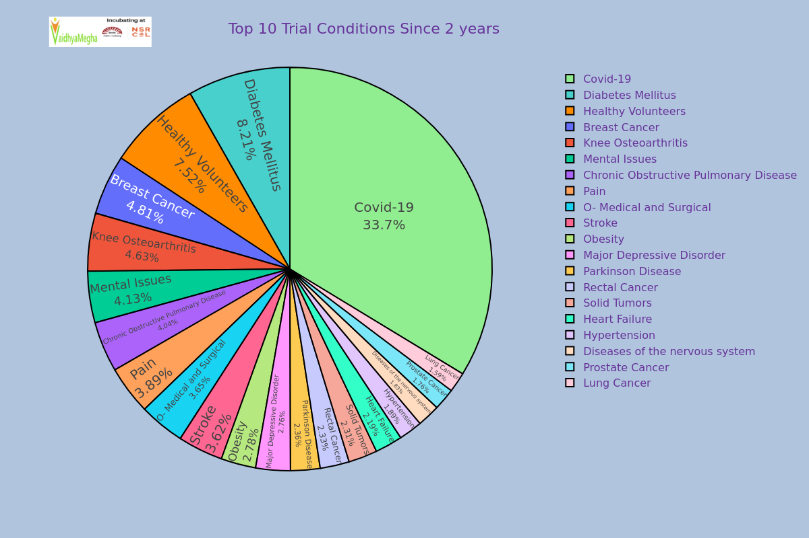
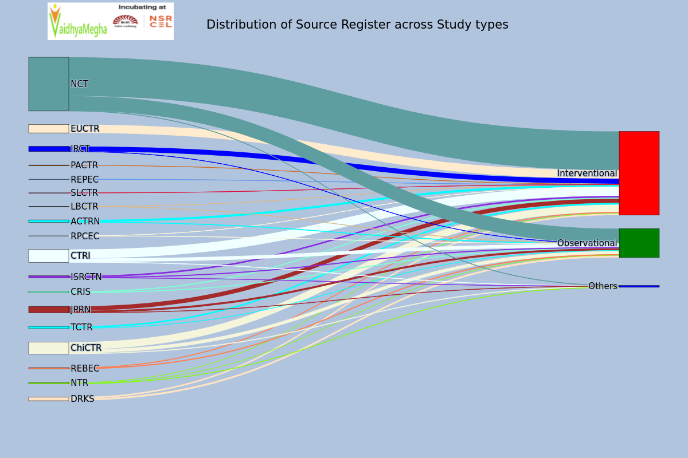
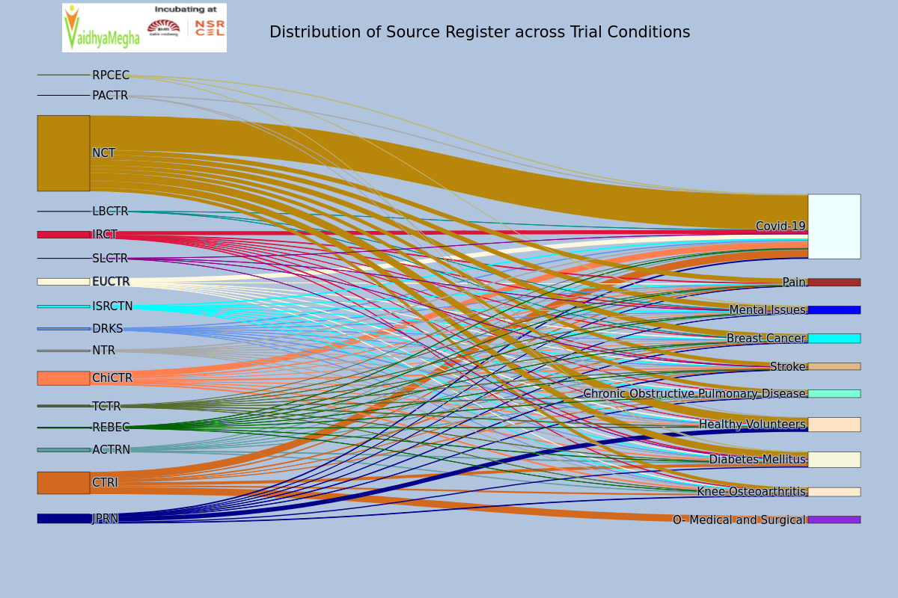
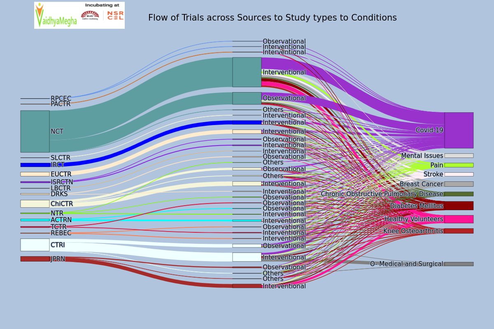

# Recent changes in clinical trials across the globe

# Feb 08th 2022 Observations

# Table of contents
1. [Introduction](#Introduction)
2. [Top 10 Trial Conditions for 2 years](#Top10TrialConditions)
3. [Distribution of Source Register across Study types for 2 years](#Source_to_Study)    
4. [Distribution of Source Register across Trial Conditions for 2 years](#Source_to_Conditions)
5. [Flow of Trials across Sources to Study types to Conditions for 2 years](#Source_to_StudyType_to_Conditions)

## Introduction 
With reference to WHO’s ICTRP dataset for the last 2 years and performed 2 times in the time range of a week.

## Top 10 Trial Conditions for 2 years 

**Analysis Performed on 8th Feb, 2022**
 <!--  -->

 

**Analysis Performed on 1st Feb, 2022**
<!--  -->

By seeing above two charts of analysis which were performed on 8th Feb 2022 and 1st Feb 2022 , we can observe that the changes of percentages of some trials in a week approximately.

| S. No. |             Trial Condition            | % Of first analysis | % Of second analysis |       Remarks      |
|:------:|:--------------------------------------:|:-------------------:|:--------------------:|:------------------:|
| 1      | Covid -19                              | 33.9                | 33.7                 | Increased by 0.2%  |
| 2      | Diabetes Mellitus                      | 8.20                | 8.21                 | Decreased by 0.1% |
| 3      | Healthy Volunteers                     | 7.48                | 7.52                 | Decreased by 04% |
| 4      | Breast Cancer                          | 4.77                | 4.81                 | Decreased by 0.4%  |
| 5      | Knee Osteoarthritis                    | 4.64                | 4.63                 | Decreased by 01% |
| 6      | Mental Issues                          | 4.11                | 4.13                 | Decreased by 02% |
| 7      | Chronic Obstructive Pulmonary Diseases | 42                | 44                 | Decreased by 02% |
| 8      | Pain                                   | 3.90                | 3.89                 | Increased by 01% |
| 9      | O- Medical and Surgical                | 3.66                | 3.65                 | Increased by 01% |
| 10     | Stroke                                 | 3.60                | 3.62                 | Decreased by 02% |

From the above there is a 0.2% increment in Covid-19 and 0.1% increment in Pain and O- Medical and Surgical trial conditions.

## Distribution of Source Register across Study types for 2 years 

**Analysis Performed on 8th Feb, 2022**
<!--  -->

**Analysis Performed on 1st Feb, 2022**
<!--  -->

 | S.No |sources |Interventional |Observational |Others |
 |--- | --- | --- | --- | --- | 
 | 1 | ACTRN | 25 | 3 |  | 
 | 2 | CRIS | -36 | -4 |  | 
 | 3 | CTRI | -102 | -45 | -1 | 
 | 4 | ChiCTR | -47 | -22 | -17 | 
 | 5 | DRKS | -22 | -18 |  | 
 | 6 | EUCTR | -20 |  |  | 
 | 7 | IRCT | -103 | 0 |  | 
 | 8 | ISRCTN | -4 | 4 | -1 | 
 | 9 | JPRN | -89 | -42 | -5 | 
 | 10 | LBCTR | -1 | 0 |  | 
 | 11 | NCT | -467 | -149 | -6 | 
 | 12 | NTR | -12 | -10 | 0 | 
 | 13 | PACTR | -7 |  |  | 
 | 14 | REBEC | -44 | -3 |  | 
 | 15 | REPEC | -1 |  |  | 
 | 16 | RPCEC | 0 | 0 |  | 
 | 17 | SLCTR | -1 |  |  | 
 | 18 | TCTR | -14 | -6 |  | 

The above table represents the changes in clinical trials registrations in  a week approximately.

# Distribution of Source Register across Trial Conditions for 2 years 

**Analysis Performed on 8th Feb, 2022**
<!--  -->

**Analysis Performed on 1st Feb, 2022**
<!--  -->

 | sources |Breast Cancer |Chronic Obstructive Pulmonary Disease |Covid-19 |Diabetes Mellitus |Healthy Volunteers |Knee Osteoarthritis |Mental Issues |O- Medical and Surgical |Pain |Stroke |
 |--- | --- | --- | --- | --- | --- | --- | --- | --- | --- | --- | 
 | ACTRN | 0 | 0 | 2 | 1 |  | -1 | 1 |  | 4 | -2 | 
 | CTRI | -1 | -2 | 0 | -5 |  | -1 |  | -4 | -2 | 0 | 
 | ChiCTR | 0 | 0 | -15 | -2 | 0 | -2 | 0 |  | 0 | -2 | 
 | DRKS | 0 | 0 | 0 | 0 | -1 | -1 | 0 |  | 0 | 0 | 
 | EUCTR | 0 | 0 | 2 | -1 | 0 | 0 |  |  | 0 | 0 | 
 | IRCT | 0 | 0 | 0 | -2 | 0 | -1 | -2 |  | -1 | 0 | 
 | ISRCTN | 0 | -1 | 6 | 0 | 0 | 0 | 0 |  | 0 | 0 | 
 | JPRN | 0 | 0 | 0 | -1 | -17 | 0 | -4 |  | -1 | -1 | 
 | LBCTR | 0 |  | 0 |  |  |  | 0 |  |  |  | 
 | NCT | -18 | -9 | 4 | -8 | -7 | -1 | -7 |  | -7 | -6 | 
 | NTR | 0 | 0 | 0 | 0 | 0 | 0 | 0 |  | 0 | -1 | 
 | PACTR |  |  | 0 | 0 | 0 |  |  |  |  |  | 
 | REBEC | 0 | 0 | 0 | -2 | 0 | 0 | 0 |  | 0 | 0 | 
 | RPCEC |  |  | 0 | 0 |  |  | 0 |  |  |  | 
 | SLCTR |  |  | 0 | 0 |  |  | 0 |  |  | 0 | 
 | TCTR | 0 | 0 | 0 | 0 | -1 | 0 | 0 |  | 0 | 0 | 

The above table represents the increment in clinical trials registrations in a week approximately.
From the above table, clinical trials on Covid-19 were registered from almost every Source. Diabetes Mellitus , Psychological problems and Stroke are also health issues in almost every nation.

# Flow of Trials across Sources to Study types to Conditions for 2 years 

**Analysis Performed on 8th Feb, 2022**
<!--  -->

**Analysis Performed on 1st Feb, 2022**
<!--  -->

