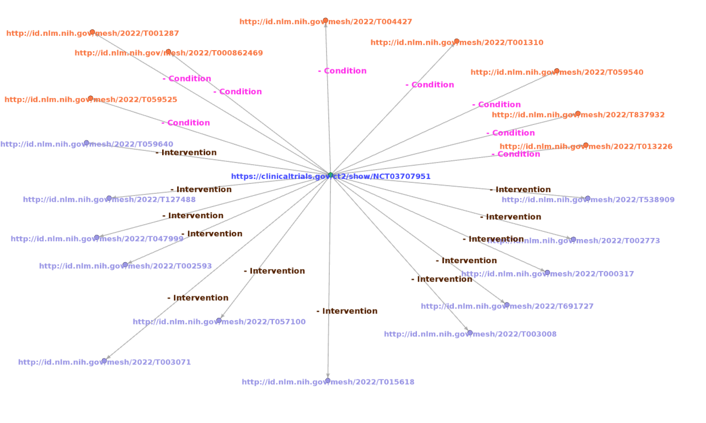
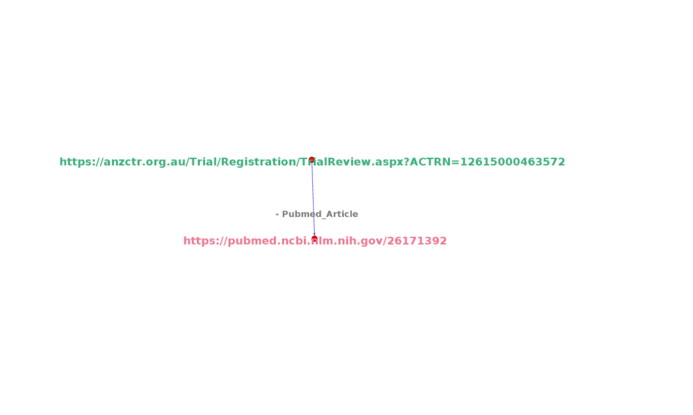
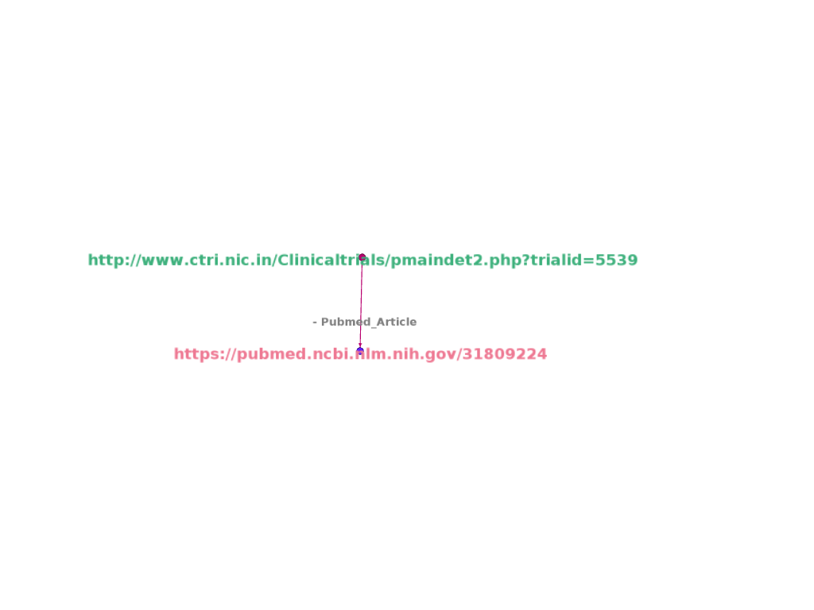
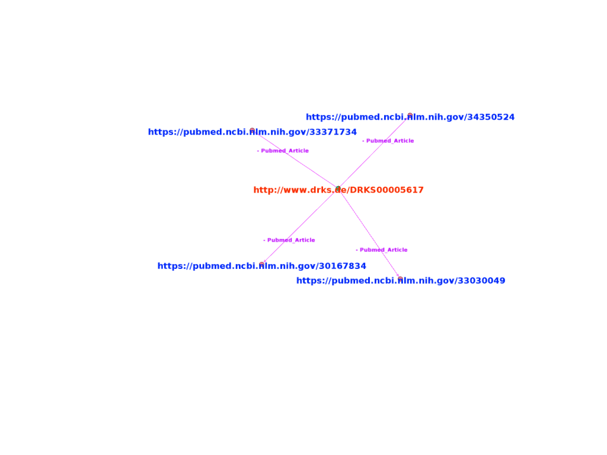
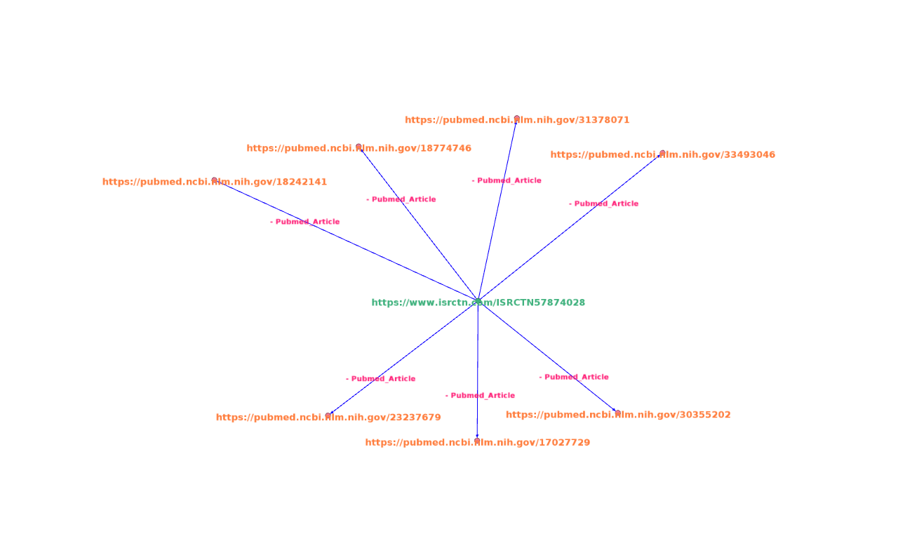

# Visualisation of Knowledge Graph

## Introduction 

In this visualisation, knowledge graph of clinical trials are represented, by linking clinical trial id to on what Conditions trial is conducted, what type of Interventions are employed during trial and what articles are being cited.

In below sections figure, the Source is the **centre node**, which  is a **trial link**.

Nodes around the centre node(**periphery nodes**) are target nodes, which are  **LInks to Conditions, Interventions and Articles**.

**Edges** create link between source and targets. They establish a relationship between two nodes and type relation is labeled on edges. Here, there are three **types of relations ie., Conditions, Interventions and Pubmed articles**.

A trial can be conducted on different conditions and interventions which are defined by the MeSH(Medical Subject Headings) term. So a trial will have one or more conditions and interventions.

## NCT 

[//]: # ( )

### Description

-  https://clinicaltrials.gov/ct2/show/NCT03707951 represents the link to trial details. NCT03707951 represents the trial ID. and it was registered with National Clinical Registry of USA. Trial title is **"A Proof-of-Concept Trial of N-Acetylcysteine for Adolescent Alcohol Use Disorder".**

- http://id.nlm.nih.gov/mesh/2022/T001310 represents the link to condition of trial. T001310 represents the MeSH id for **"Alcoholism"** condition.

- http://id.nlm.nih.gov/mesh/2022/T057100 represents the link to intervention in trial.T057100 represents the MeSH id for **"Respiratory System Agents"** intervention.

## ACTRN 

[//]: # ( )

### Description

- https://anzctr.org.au/Trial/Registration/TrialReview.aspx?ACTRN=12615000463572 represents the link to trial details. ACTRN12615000463572 represents the trial ID. and it was registered with Austrilian Newzealand Clinical Trial Registry. Trial Public title  is **"Management of Postoperative Pain After Total Knee Arthroplasty".**

- https://pubmed.ncbi.nlm.nih.gov/26171392 represents the link to article cited with respect to trial. Title of article is **"Analgesic Effects of Intra-Articular Bupivacaine/Intravenous Parecoxib Combination Therapy versus Intravenous Parecoxib Monotherapy in Patients Receiving Total Knee Arthroplasty: A Randomized, Double-Blind Trial".**

## CTRI 

[//]: # ( )

### Description

- http://www.ctri.nic.in/Clinicaltrials/pmaindet2.php?trialid=5539 represents the link to trial details. It was registered withClinical Trials Registry of India. Trial Public Title is **"A clinical trial to study the effects of two Anti-CD20 monoclonal antibodies in combination with CHOP in patients with diffuse large B-cell Lymphoma. ".**

- https://pubmed.ncbi.nlm.nih.gov/31809224 represents the link to article cited with respect to trial. Title of article is **"Randomized, Double-Blind, Pharmacokinetic Equivalence Trial Comparing DRL-Rituximab With MabThera in Patients With Diffuse Large B-Cell Lymphoma".**

## DRKS 

[//]: # ( )

### Description

- http://www.drks.de/DRKS00005617 represents the link to trial details. DRKS00005617 represents the trial ID. and it was registered with German Clinical Trials Register.   Trial title is **"A Registry for Evaluation of Efficiency and Safety of Surgical Treatment of Cartilage Defects of the knee".**

- https://pubmed.ncbi.nlm.nih.gov/30167834 represents the link to article cited with respect to trial. Title of article is **"What parameters affect knee function in patients with untreated cartilage defects: baseline data from the German Cartilage Registry".**

## ISRCTN 

[//]: # ( )

### Description

- https://www.isrctn.com/ISRCTN57874028 represents the link to trial details. ISRCTN57874028 represents the trial ID. and it was registered with International Standard Randomised Controlled Trial Number. Trial title is **"Stent-protected Percutaneous Angioplasty of the Carotid artery versus Endarterectomy".**

- https://pubmed.ncbi.nlm.nih.gov/31809224 represents the link to article cited with respect to trial. Title of article is **"Absence of Consistent Sex Differences in Outcomes From Symptomatic Carotid Endarterectomy and Stenting Randomized Trials".**

