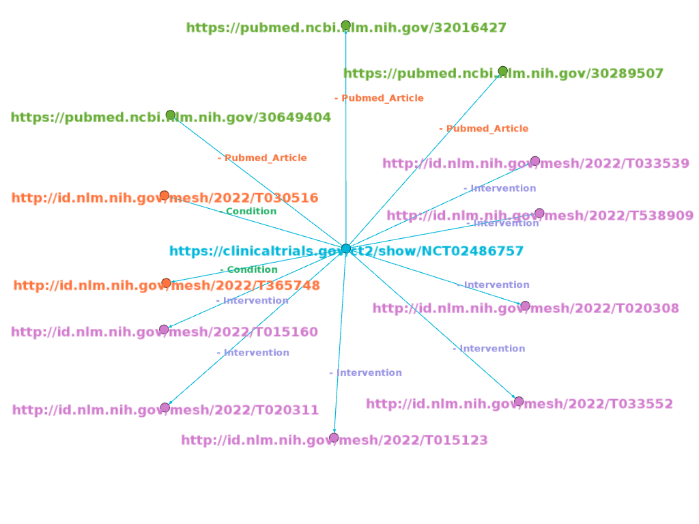
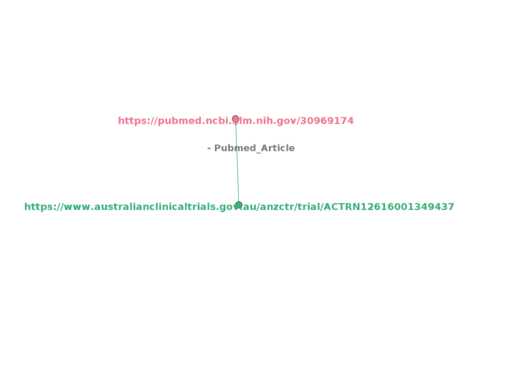
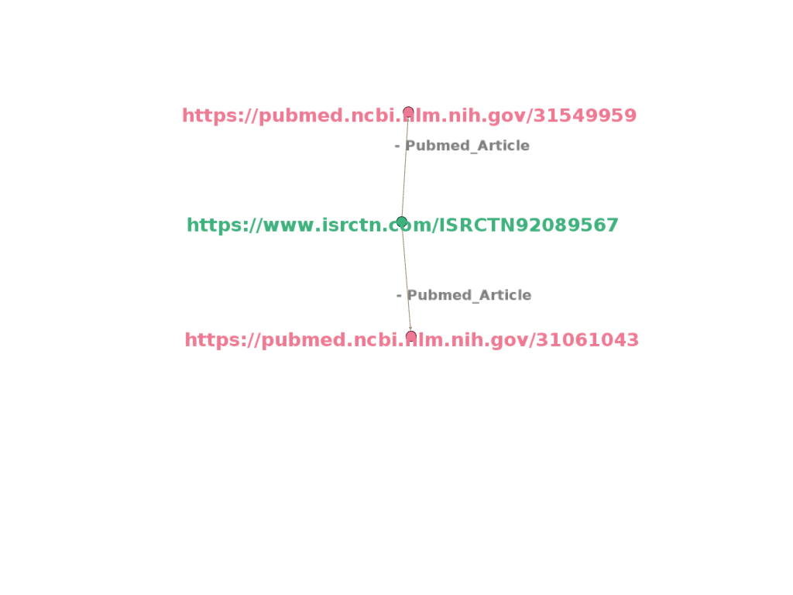

# Visualisation of Knowledge Graph

# Introduction 

In this visualization, knowledge graphs of clinical trials are represented, by linking clinical trial id to on what Conditions trial is conducted, what type of Interventions are employed during trial and what articles are being cited.

In visualization of knowledge graphs, the Source is the **center node**, which is a **trial link**.

Nodes around the center node(**periphery nodes**) are target nodes, which are **LInks to Conditions, Interventions and Articles**.

**Edges** create links between source and targets. They establish a relationship between two nodes and type relation is labeled on edges. Here, there are three **types of relations ie., Conditions, Interventions and Pubmed articles**.

A trial can be conducted on different conditions and interventions which are defined by the MeSH(Medical Subject Headings) term. So a trial will have one or more conditions and interventions.

# NCT 

 
[//]: # (![NCT]&#40;images/NCT.png&#41;)

## Description

- https://clinicaltrials.gov/ct2/show/NCT02486757 represents the link to trial details. NCT02486757 represents the trial ID. and it was registered with the National Clinical Registry of USA. Trial title is “**Investigation of Female Reproductive Hormone Dynamics During Adolescence**”.

- http://id.nlm.nih.gov/mesh/2022/T365748 represents the link to the condition of trial. T365748 represents the MeSH id for “**Menstruation Disturbances**” condition.

- http://id.nlm.nih.gov/mesh/2022/T020311 represents the link to intervention in the trial. T020311 represents the MeSH id for “**Hormones, Hormone Substitutes, and Hormone Antagonists**” intervention.

- https://pubmed.ncbi.nlm.nih.gov/30649404 represents the link to article cited with respect to trial. Title of article is "**The Relationship Between Progesterone, Sleep, and LH and FSH Secretory Dynamics in Early Postmenarchal Girls**".

# ACTRN 

 
[//]: # (![ACTRN]&#40;images/ACTRN.png&#41;)

## Description

- https://www.australianclinicaltrials.gov.au/anzctr/trial/ACTRN12616001349437 represents the link to trial details. ACTRN12616001349437 represents the trial ID. and it was registered with Austrilian Newzealand Clinical Trial Registry. Trial Public title  is "**The Mindfulness App Trial for Weight, Weight related Behaviours, and Stress in University Students.**".

- https://pubmed.ncbi.nlm.nih.gov/30969174 represents the link to article cited with respect to trial. Title of article is "**The Mindfulness App Trial for Weight, Weight-Related Behaviors, and Stress in University Students: Randomized Controlled Trial**".

# ISRCTN 

 
[//]: # (![ISRCTN]&#40;images/ISRCTN.png&#41;)

## Description

- https://www.isrctn.com/ISRCTN92089567 represents the link to trial details. ISRCTN34806867 represents the trial ID. and it was registered with the International Standard Randomised Controlled Trial Number. Trial title is “**Trial of acute femoral fracture fixation**”.

- https://pubmed.ncbi.nlm.nih.gov/31549959 represents the link to the article cited with respect to trial. Title of the article is “**Retrograde intramedullary nail fixation compared with fixed-angle plate fixation for fracture of the distal femur: the TrAFFix feasibility RCT**”.

