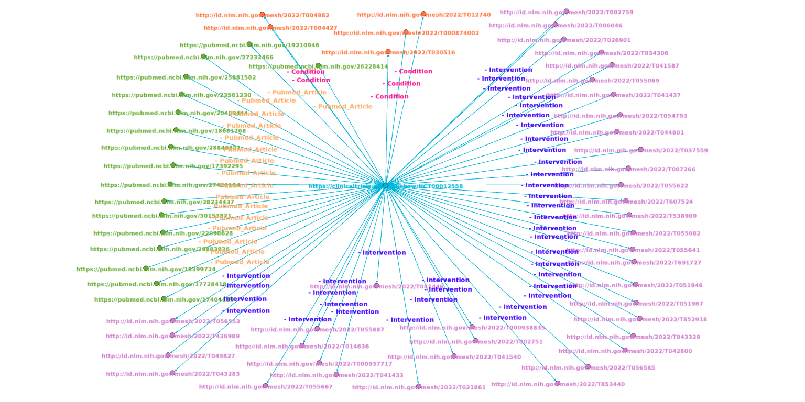
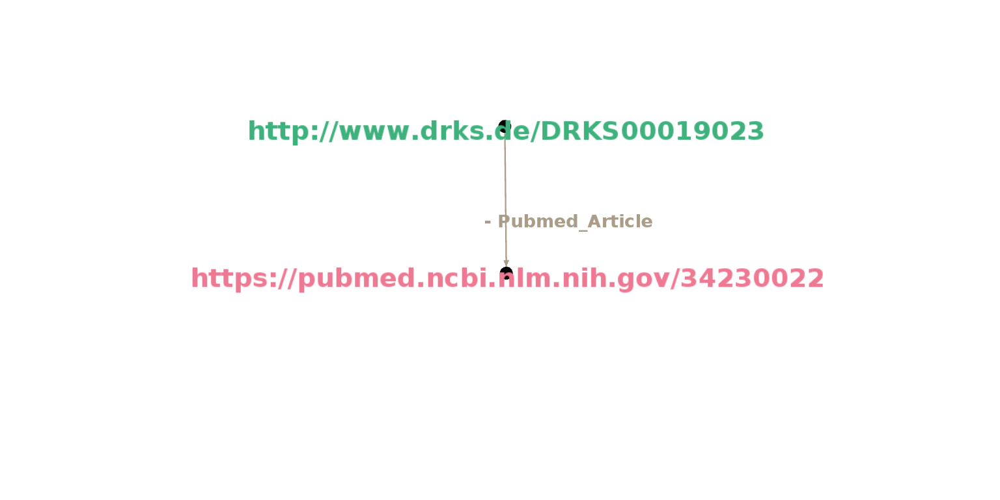
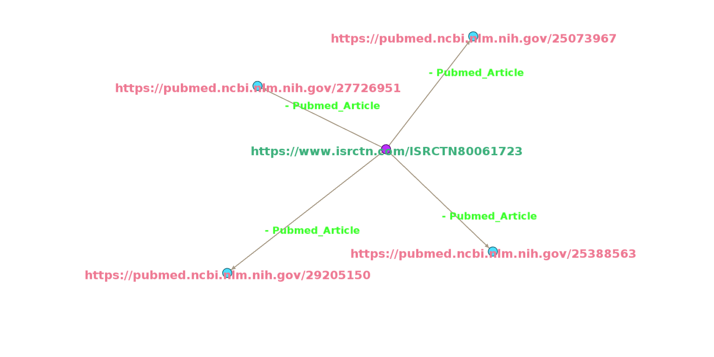

# Visualisation of Knowledge Graph

## Introduction 

In this visualization, knowledge graphs of clinical trials are represented, by linking clinical trial id to on what Conditions trial is conducted, what type of Interventions are employed during trial and what articles are being cited.

In visualization of knowledge graphs, the Source is the **center node**, which is a **trial link**.

Nodes around the center node(**periphery nodes**) are target nodes, which are **LInks to Conditions, Interventions and Articles**.

**Edges** create links between source and targets. They establish a relationship between two nodes and type relation is labeled on edges. Here, there are three **types of relations ie., Conditions, Interventions and Pubmed articles**.

A trial can be conducted on different conditions and interventions which are defined by the MeSH(Medical Subject Headings) term. So a trial will have one or more conditions and interventions.

## NCT 

 

[//]: # (![NCT]&#40;images/NCT.png&#41;)

### Description

- https://clinicaltrials.gov/ct2/show/NCT00012558 represents the link to trial details. NCT00012558 represents the trial ID. and it was registered with the National Clinical Registry of USA. Trial title is “**Systematic Treatment Enhancement Program for Bipolar Disorder**”.

- http://id.nlm.nih.gov/mesh/2022/T004982 represents the link to the condition of trial. T004982 represents the MeSH id for “**Bipolar Disorder**” condition.

- http://id.nlm.nih.gov/mesh/2022/T041446 represents the link to intervention in the trial. T041446 represents the MeSH id for “**Anti-Anxiety Agents**” intervention.

## DRKS *

 

[//]: # (![DRKS]&#40;images/DRKS.png&#41;)

### Description

- http://www.drks.de/DRKS00019023 represents the link to trial details. DRKS00019023 represents the trial ID. and it was registered with the German Clinical Trials Register. Trial title is “**Validation of a German Version of the”Life-Space Assessment" questionnaire (LSA-D)**".

- https://pubmed.ncbi.nlm.nih.gov/34230022 represents the link to the article cited with respect to the trial. Title of the article is “**Validation of the German Life-Space Assessment (LSA-D): cross-sectional validation study in urban and rural community-dwelling older adults**”.

## ISRCTN 

 

[//]: # (![ISRCTN]&#40;images/ISRCTN.png&#41;)

### Description

- https://www.isrctn.com/ISRCTN80061723 represents the link to trial details. ISRCTN80061723 represents the trial ID. and it was registered with the International Standard Randomised Controlled Trial Number. Trial title is “**The eTHoS study (haemorrhoids treatment): either Traditional Haemorrhoidectomy or Stapled Haemorrhoidopexy for haemorrhoidal disease**”.

- https://pubmed.ncbi.nlm.nih.gov/29205150 represents the link to the article cited with respect to trial. Title of the article is “**A pragmatic multicentre randomised controlled trial comparing stapled haemorrhoidopexy with traditional excisional surgery for haemorrhoidal disease: the eTHoS study**”.

