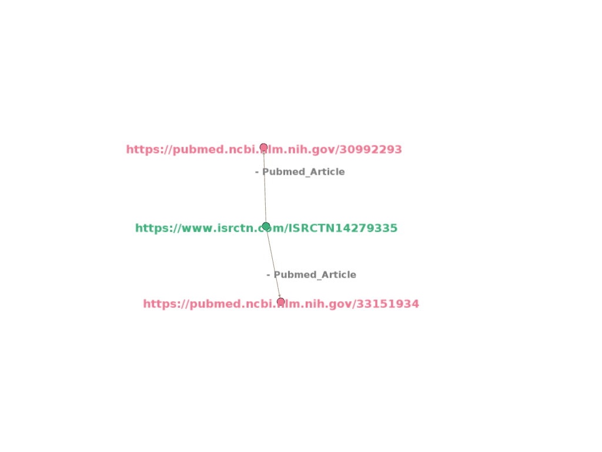

# Visualisation of Knowledge Graph

# Introduction 

In this visualization, knowledge graphs of clinical trials are represented, by linking clinical trial id to on what Conditions trial is conducted, what type of Interventions are employed during trial and what articles are being cited.

In visualization of knowledge graphs, the Source is the **center node**, which is a **trial link**.

Nodes around the center node(**periphery nodes**) are target nodes, which are **LInks to Conditions, Interventions and Articles**.

**Edges** create links between source and targets. They establish a relationship between two nodes and type relation is labeled on edges. Here, there are three **types of relations ie., Conditions, Interventions and Pubmed articles**.

A trial can be conducted on different conditions and interventions which are defined by the MeSH(Medical Subject Headings) term. So a trial will have one or more conditions and interventions.

# NCT 

 

## Description

- https://clinicaltrials.gov/ct2/show/NCT00106691 represents the link to trial details. NCT00106691 represents the trial ID. and it was registered with the National Clinical Registry of USA. Trial title is “**Prostate Cancer Prevention Study for Men With High Grade PIN (Prostatic Intraepithelial Neoplasia)**”.

- http://id.nlm.nih.gov/mesh/2022/T056880 represents the link to the condition of trial. T365748 represents the MeSH id for “**Prostatic Intraepithelial Neoplasia**” condition.

- http://id.nlm.nih.gov/mesh/2022/T051705 represents the link to intervention in the trial. T020311 represents the MeSH id for “**Toremifene**” intervention.

- https://pubmed.ncbi.nlm.nih.gov/23295793 represents the link to article cited with respect to trial. Title of article is "**Prostate cancer diagnosis among men with isolated high-grade intraepithelial neoplasia enrolled onto a 3-year prospective phase III clinical trial of oral toremifene**".

# ACTRN 

 

## Description

- https://www.australianclinicaltrials.gov.au/anzctr/trial/ACTRN12614000488606 represents the link to trial details. ACTRN12614000488606 represents the trial ID. and it was registered with Austrilian Newzealand Clinical Trial Registry. Trial Public title  is "**The Active-Team Program - a social networking physical activity intervention for inactive adults delivered via a Facebook application..**".

- https://pubmed.ncbi.nlm.nih.gov/26169067 represents the link to article cited with respect to trial. Title of article is "**A Web-Based, Social Networking Physical Activity Intervention for Insufficiently Active Adults Delivered via Facebook App: Randomized Controlled Trial**".

# ISRCTN 

 

## Description

- https://www.isrctn.com/ISRCTN14279335 represents the link to trial details. ISRCTN14279335 represents the trial ID. and it was registered with the International Standard Randomised Controlled Trial Number. Trial title is “**An intervention study to improve food shopping and prevent cardiovascular disease among patients in primary care: the PC SHOP trial**”.

- https://pubmed.ncbi.nlm.nih.gov/30992293 represents the link to the article cited with respect to trial. Title of the article is “**Primary Care SHOPping intervention for cardiovascular disease prevention (PC-SHOP): protocol for a randomised controlled trial to reduce saturated fat intake**”.

- https://pubmed.ncbi.nlm.nih.gov/33151934 represents the link to the article cited with respect to trial. Title of the article is “**Evaluation of an intervention to provide brief support and personalized feedback on food shopping to reduce saturated fat intake (PC-SHOP): A randomized controlled trial**”.

