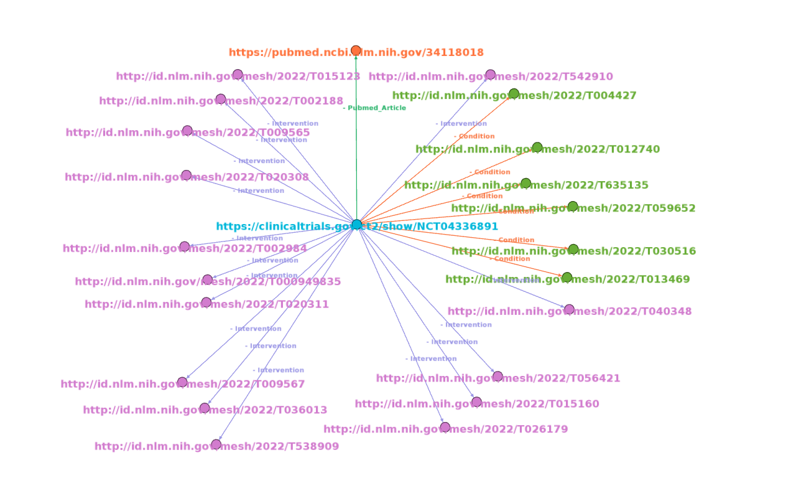

# Visualisation of Knowledge Graph

# Introduction 

In this visualization, knowledge graphs of clinical trials are represented, by linking clinical trial id to on what Conditions trial is conducted, what type of Interventions are employed during trial and what articles are being cited.

In visualization of knowledge graphs, the Source is the **center node**, which is a **trial link**.

Nodes around the center node(**periphery nodes**) are target nodes, which are **LInks to Conditions, Interventions and Articles**.

**Edges** create links between source and targets. They establish a relationship between two nodes and type relation is labeled on edges. Here, there are three **types of relations ie., Conditions, Interventions and Pubmed articles**.

A trial can be conducted on different conditions and interventions which are defined by the MeSH(Medical Subject Headings) term. So a trial will have one or more conditions and interventions.

# NCT 

 
[//]: # (![NCT]&#40;images/NCT.png&#41;)

## Description

- https://clinicaltrials.gov/ct2/show/NCT04336891 represents the link to trial details. NCT04336891 represents the trial ID. and it was registered with the National Clinical Registry of USA. Trial title is “**Effect of Testosterone Treatment on Clitoral Arteries' Hemodynamic Parameters**”.

- http://id.nlm.nih.gov/mesh/2022/T635135 represents the link to the condition of trial. T004982 represents the MeSH id for “**Sexual Dysfunction, Physiological**” condition.

- http://id.nlm.nih.gov/mesh/2022/T015123 represents the link to intervention in the trial. T041446 represents the MeSH id for “**Estradiol**” intervention.

# ACTRN 

 
[//]: # (![ACTRN]&#40;images/ACTRN.png&#41;)

## Description

- https://anzctr.org.au/Trial/Registration/TrialReview.aspx?ACTRN=12619000044123 represents the link to trial details. ACTRN12615000463572 represents the trial ID. and it was registered with Austrilian Newzealand Clinical Trial Registry. Trial Public title  is "**Erector spinae plane block for perioperative analgesia after percutaneous nephrolithotomy**".

- https://pubmed.ncbi.nlm.nih.gov/33807296 represents the link to article cited with respect to trial. Title of article is "**Erector Spinae Plane Block for Perioperative Analgesia after Percutaneous Nephrolithotomy**".

# ISRCTN 

 
[//]: # (![ISRCTN]&#40;images/ISRCTN.png&#41;)

## Description

- https://www.isrctn.com/ISRCTN34806867 represents the link to trial details. ISRCTN34806867 represents the trial ID. and it was registered with the International Standard Randomised Controlled Trial Number. Trial title is “**HEADS-UP: a structured team intervention to improve safety and quality on medical wards**”.

- https://pubmed.ncbi.nlm.nih.gov/28385912 represents the link to the article cited with respect to trial. Title of the article is “**Translating concerns into action: a detailed qualitative evaluation of an interdisciplinary intervention on medical wards**”.

