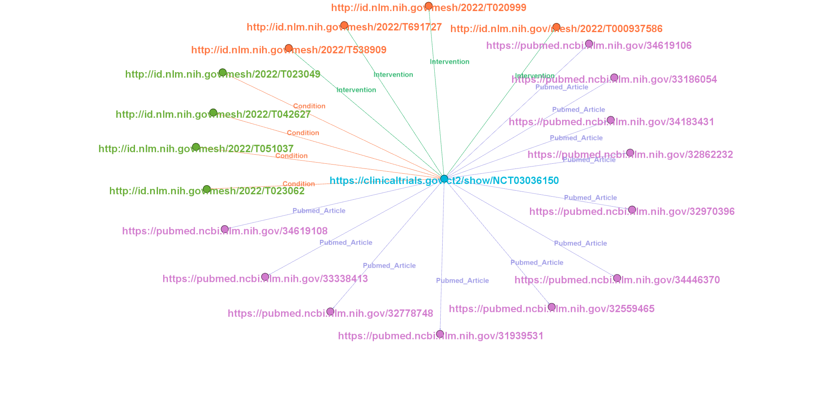

# Visualisation of Knowledge Graph

## Introduction

In this visualisation, knowledge graph of clinical trials are represented, by linking clinical trial id to on what Conditions trial is conducted, what type of Interventions are employed during trial and what articles are being cited.

<!--  -->

## Description
In the above figure, the source is the centre node, which  is a trial.

Nodes around the centre node are target nodes of Conditions, Interventions and Articles.

Edges create link between source and targets. They establish a relationship between two nodes and type relation is labeled on edges. Here, there are three types of relations ie., Conditions, Interventions and Pubmed articles.

A trial can be conducted on different conditions and interventions which are defined by the MeSH(Medical Subject Headings) term. So a trial will have one or more conditions and interventions.

-  https://clinicaltrials.gov/ct2/show/NCT03036150 represents the link to trial details. NCT03036150 represents the trial ID. and it was registered with National Clinical Registry of USA.
Trial title is **"A Study to Evaluate the Effect of Dapagliflozin on Renal Outcomes and Cardiovascular Mortality in Patients With Chronic Kidney Disease (Dapa-CKD)".**

- http://id.nlm.nih.gov/mesh/2022/T023062 represents the link to condition of trial. T023062 represents the MeSH id for **"Chronic Renal Insufficiencies"** condition.

- http://id.nlm.nih.gov/mesh/2022/T020999 represents the link to intervention in trial.T020999 represents the MeSH id for **"Hypoglycemic Agents"** intervention.

- https://pubmed.ncbi.nlm.nih.gov/34619108 represents the link to article cited with respect to trial. Title of article is **"Effect of dapagliflozin on the rate of decline in kidney function in patients with chronic kidney disease with and without type 2 diabetes: a prespecified analysis from the DAPA-CKD trial".**

